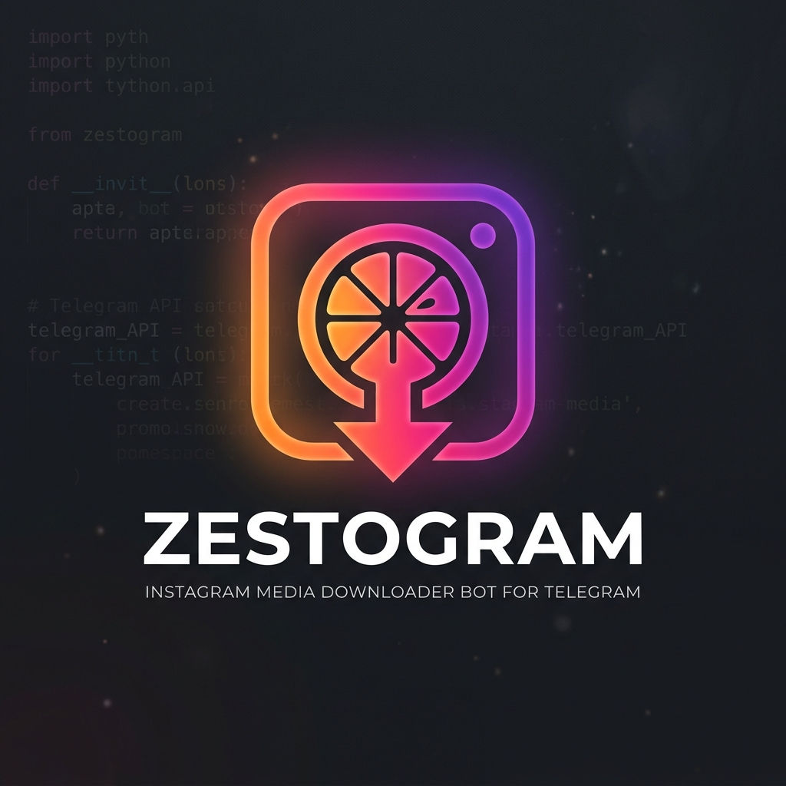

<p align="center">
  
</p>

# Zestogram - Telegram Instagram Downloader Bot

A self-hosted Telegram bot that runs continuously to download Instagram media (Reels, Posts, Carousels, IGTV, Stories) and send it back to you. It uses `yt-dlp` for robust downloading, supports concurrent processing via an async queue, and leverages a local Telegram Bot API server to bypass the 50MB file size limit.

## Prerequisites

- **Docker** and **Docker Compose** installed on your machine.
- A Telegram bot token from [@BotFather](https://t.me/BotFather).
- (Optional but recommended) Your `api_id` and `api_hash` from [my.telegram.org](https://my.telegram.org) to run the local Bot API server (bypasses the 50MB upload limit).

## Setup Instructions

1. **Clone the repository:**
   ```bash
   git clone <your-repo-url>
   cd zestogram
   ```

2. **Configure Environment:**
   Copy the example environment file and fill it out:
   ```bash
   cp .env.example .env
   ```
   Open `.env` and fill in the required values:
   - `TELEGRAM_BOT_TOKEN`: Your bot token.
   - `TELEGRAM_API_ID` & `TELEGRAM_API_HASH`: Your Telegram API credentials.
   - `ALLOWED_USER_IDS`: Your Telegram user ID (leave empty at your own risk to allow anyone).

3. **Provide Instagram Cookies (Highly Recommended):**
   Instagram frequently blocks anonymous requests. To fix this, provide a `cookies.txt` file.
   - Install a browser extension like "Get cookies.txt LOCALLY" (Chrome) or "Export Cookies" (Firefox).
   - Log into Instagram in your browser.
   - Use the extension to export cookies in Netscape format.
   - Save the file as `data/cookies.txt` in the root of the project (create the `data` folder if it doesn't exist).
   *Note: Cookies expire over time. If downloads start failing, re-export and replace the file.*

4. **Start the Bot:**
   ```bash
   docker compose up -d
   ```
   
5. **Use the Bot:**
   Send `/start` to your bot on Telegram. Then, send any Instagram link to have it downloaded!

## Troubleshooting

| Symptom | Likely Cause | Fix |
| :--- | :--- | :--- |
| **Downloads fail or return an error** | Cookies expired or missing | Re-export `cookies.txt` from your browser and place it in the `data/` directory. |
| **File never arrives (large video)** | `USE_LOCAL_BOT_API` is not set properly | Check `.env` for `USE_LOCAL_BOT_API=true` and ensure `TELEGRAM_API_ID` and `HASH` are correct. |
| **Bot not responding** | Bot crashed or stopped | Run `docker compose logs -f bot` to view errors. |
| **Unauthorized message** | Your user ID is not in `ALLOWED_USER_IDS` | Add your numeric user ID (from a bot like @userinfobot) to `.env` and restart. |

## Updating yt-dlp

When Instagram changes its API, `yt-dlp` might break. To update it:
1. Open `requirements.txt` and bump the `yt-dlp` version to the latest.
2. Rebuild the image: `docker compose build --no-cache bot`
3. Restart: `docker compose up -d`

## Backup & Maintenance

- **View logs:** `docker compose logs -f bot`
- **Stop bot:** `docker compose down`
- **Database Backup:** The history is stored in `data/bot.db`. Copy this file to back it up.
